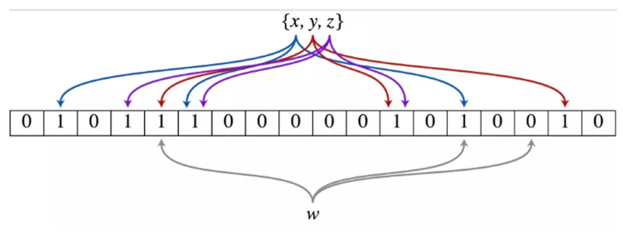
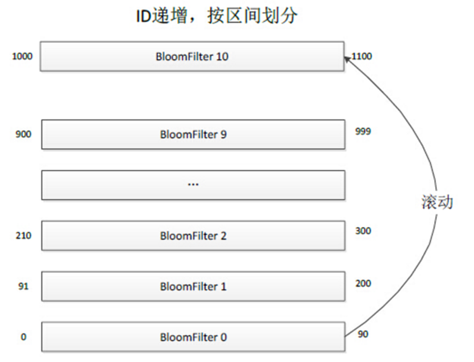

点赞问题
==

题目：

如何判断某一微博当前用户是否赞过？

这种场景有个很大的特点，它检查是否存在，因此每条记录非常小，比如 Value 用 1 个位存储就够了，但总数据量又非常巨大。比如每天新发布的微博数量在 1 亿条左右，是否被用户读过的总数据量可能有上千亿，怎么存储是个非常大的挑战。

而且还有一个特点是，大多数微博是否被用户读过的存在性都是 0，如果存储 0 的话，每天就得存上千亿的记录；如果不存的话，就会有大量的请求最终会穿透 Cache 层到 DB 层，任何 DB 都没有办法抗住那么大的流量。

假设每天要存储上千亿条记录，用原生的 Redis 存储显然是不可行的，因为原生的 Redis，单个 KV 就占了 65 个字节，这样每天存储上千亿条记录，需要增加将近 6TB 存储，显然是不可接受的。

所以就迫切需要一种更加精密的存储方案，针对存在性判断的场景能够最大限度优化存储空间。

如果是你，会怎么处理？

这里我们使用[“布隆过滤器”](https://zh.wikipedia.org/wiki/%E5%B8%83%E9%9A%86%E8%BF%87%E6%BB%A4%E5%99%A8)。

布隆过滤器（Bloom Filter）是1970年由布隆提出的。

其核心实现是一个超大的位数组和几个哈希函数。当一个元素被加入集合时，通过K个散列函数将这个元素映射成一个位数组中的K个点，把它们置为1。检索时，我们只要看看这些点是不是都是1就（大约）知道集合中有没有它了：如果这些点有任何一个0，则被检元素一定不在；如果都是1，则被检元素很可能在。这就是布隆过滤器的基本思想。

所以它的数学原理就是：两个完全随机的数字相冲突的概率很小，因此，可以在很小的误识别率条件下，用很少的空间存储大量的信息。

它只需要hash table的1/8到1/4的空间即可。

那么我们可以这么解决点赞的问题。

使用了分 Table 的存储方案，每个 Table 是一个完整的 BloomFilter，每个 BloomFilter 存储的某个 ID 范围段的 Key，所有 Table 形成一个列表并按照 Key 范围有序递增。当所有 Table 都存满的时候，就把最小的 Table 数据清除，存储最新的 Key，这样的话最小的 Table 就滚动成为最大的 Table 了。

当一个 Key 的读写请求过来时，先根据 Key 的范围确定这个 Key 属于哪个 Table，然后再根据 BloomFilter 的算法判断这个 Key 是否存在。