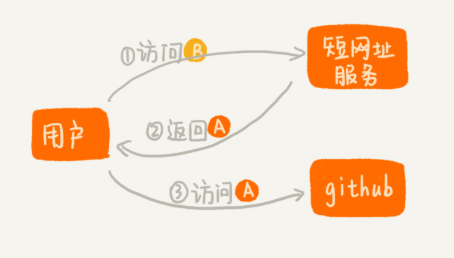

如何设计一个短网址系统？
==

短网址服务你用过吗？我们在微博里经常可以看到类似这样的网址：http://t.cn/EtR9QEQ，访问这个短网址实际就是访问原来的网址。

假如我这个短网址对应的原来的网址是Github的，那么整个交互的过程可能是这样：

所以，短网址服务的一个核心功能，就是把原始的长网址转化成短网址。除了这个功能之外，短网址服务还有另外一个必不可少的功能。那就是，当用户点击短网址的时候，短网址服务会将浏览器重定向为原始网址。

今天我们要看的是如何将长网址转成短网址。

好了，你肯定想到了，用哈希算法啊。

### 什么是哈希算法？

对于不熟悉哈希的同学，我们先简单介绍一下。

哈希算法的定义和原理非常简单，基本上一句话就可以概括了。将任意长度的二进制值串映射为固定长度的二进制值串，这个映射的规则就是哈希算法，而通过原始数据映射之后得到的二进制值串就是哈希值。但是，要想设计一个优秀的哈希算法并不容易，根据我的经验，我总结了需要满足的几点要求：

- 从哈希值不能反向推导出原始数据（所以哈希算法也叫单向哈希算法）；
- 对输入数据非常敏感，哪怕原始数据只修改了一个 Bit，最后得到的哈希值也大不相同；
- 散列冲突的概率要很小，对于不同的原始数据，哈希值相同的概率非常小；
- 哈希算法的执行效率要尽量高效，针对较长的文本，也能快速地计算出哈希值。

哈希算法的应用非常非常多，最常见的七个，分别是

- 安全加密（MD5，SHA，DES，AES）
- 唯一标识
- 数据校验
- 散列函数（Session Sticky）
- 负载均衡
- 数据分片
- 分布式存储（一致性哈希）

### 如何通过哈希算法生成短网址

好了，回到正文。

那么我们选择什么哈希算法来生成短网址呢？刚才我们已经提过一些哈希算法了，比如 MD5、SHA 等。但是，实际上，我们并不需要这些复杂的哈希算法。在生成短网址这个问题上，毕竟，我们不需要考虑反向解密的难度，所以我们只需要关心哈希算法的计算速度和冲突概率。

能够满足这样要求的哈希算法有很多，其中比较著名并且应用广泛的一个哈希算法，那就是[MurmurHash 算法](https://zh.wikipedia.org/wiki/Murmur%E5%93%88%E5%B8%8C)。尽管这个哈希算法在 2008 年才被发明出来，但现在它已经广泛应用到 Redis、MemCache、Cassandra、HBase、Lucene 等众多著名的软件中。

### 如何解决冲突

大家要明白，任何哈希算法都无法完全避免冲突，所以，冲突怎么办？

假如我们将短网址和原网址的对应关系存到MySql中。当有一个新的原始网址需要生成短网址的时候，我们先利用 MurmurHash 算法，生成短网址。然后，我们拿这个新生成的短网址，在 MySQL 数据库中查找。

如果没有找到相同的短网址，这也就表明，这个新生成的短网址没有冲突。于是我们就将这个短网址返回给用户（请求生成短网址的用户），然后将这个短网址与原始网址之间的对应关系，存储到 MySQL 数据库中。

如果我们在数据库中，找到了相同的短网址，那也并不一定说明就冲突了。我们从数据库中，将这个短网址对应的原始网址也取出来。如果数据库中的原始网址，跟我们现在正在处理的原始网址是一样的，这就说明已经有人请求过这个原始网址的短网址了。我们就可以拿这个短网址直接用。如果数据库中记录的原始网址，跟我们正在处理的原始网址不一样，那就说明哈希算法发生了冲突。不同的原始网址，经过计算，得到的短网址重复了。这个时候，我们该怎么办呢？

我们可以给原始网址拼接一串特殊字符，比如“[DUPLICATED]”，然后跟再重新计算哈希值，两次哈希计算都冲突的概率，显然是非常低的。假设出现非常极端的情况，又发生冲突了，我们可以再换一个拼接字符串，比如“[OHMYGOD]”，再计算哈希值。然后把计算得到的哈希值，跟原始网址拼接了特殊字符串之后的文本，一并存储在 MySQL 数据库中。

好了，今天的内容就到这里，MurmurHash目前已经有各种语言的实现了，你可以开始动手做了哦。