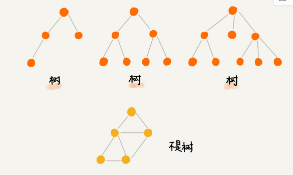
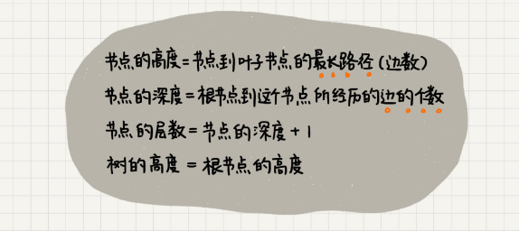
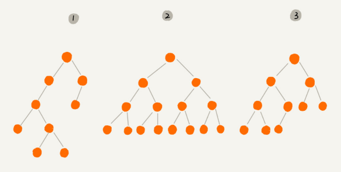
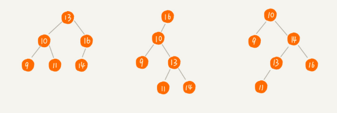
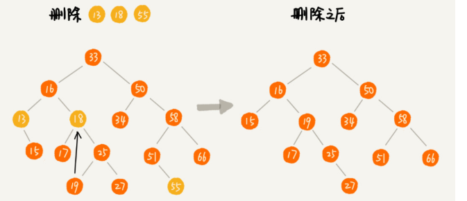

Binary Tree
==

到目前为止，我们只研究了线性数据结构，但现实世界中的所有信息都无法以线性方式表示，而这正是树这种数据结构的用处。

那什么是树？上图



你有没有发现，“树”这种数据结构真的很像我们现实生活中的“树”，这里面每个元素我们叫作“节点”；用来连线相邻节点之间的关系，我们叫作“父子关系”。

关于“树”，还有三个比较相似的概念：高度（Height）、深度（Depth）、层（Level）。它们的定义是这样的：



树结构多种多样，不过我们最常用还是二叉树。（终于说到正题了）

二叉树，顾名思义，每个节点最多有两个“叉”，也就是两个子节点，分别是左子节点和右子节点。不过，二叉树并不要求每个节点都有两个子节点，有的节点只有左子节点，有的节点只有右子节点。



这个图里面，有两个比较特殊的二叉树，分别是编号 2 和编号 3 这两个。

其中，编号 2 的二叉树中，叶子节点全都在最底层，除了叶子节点之外，每个节点都有左右两个子节点，这种二叉树就叫作**满二叉树**。

编号 3 的二叉树中，叶子节点都在最底下两层，最后一层的叶子节点都靠左排列，并且除了最后一层，其他层的节点个数都要达到最大，这种二叉树叫作**完全二叉树**。

好，理论说完了。

二叉树最常见的问题，例如如何遍历它们，计算节点，查找深度，以及检查它们是否平衡。后面我们就开始刷题吧。

### 实现二叉查找树

二叉查找树是二叉树中最常用的一种类型，也叫二叉搜索树。顾名思义，二叉查找树是为了实现快速查找而生的。不过，它不仅仅支持快速查找一个数据，还支持快速插入、删除一个数据。它是怎么做到这些的呢？

这些都依赖于二叉查找树的特殊结构。二叉查找树要求，在树中的任意一个节点，其左子树中的每个节点的值，都要小于这个节点的值，而右子树节点的值都大于这个节点的值。



我们今天来第一题，先看看怎么实现一个二叉查找树，然后给它添加几个简单的功能。

这是我给的[参考答案](./bst.js)


### 前序遍历

好的，今天开始我们来讨论一下二叉树的遍历。

对于二叉树，有深度遍历和广度遍历，深度遍历有前序、中序以及后序三种遍历方法，广度遍历即我们平常所说的层次遍历。

今天我们先看看前序遍历。

前序遍历：根结点 ---> 左子树 ---> 右子树

树由于它本身的结构，使用递归来遍历的话代码是非常简洁的，我们可以尝试两种写法，一种递归，一种循环。看看你是否写得来。

今天的[参考答案](./preOrder.js)


### 中序和后序遍历

上一节我们讲了前序遍历，那么今天就来看看中序和后序遍历。

前序遍历：根结点 ---> 左子树 ---> 右子树

中序遍历：左子树 ---> 根结点 ---> 右子树

后序遍历：左子树 ---> 右子树 ---> 根结点  

用递归实现起来都是很简洁的，用循环实现实际上是有一定难度的，特别是后序遍历。

使用循环实现的时候我们都用到了堆栈，用堆栈的后进先出来保存我们的访问顺序。

大家可以试试看。

参考答案：[中序遍历](./inOrder.js)、[后序遍历](./postOrder.js)


### 二叉查找树的增删查

之前我们讲了二叉树的遍历，实际上和二叉查找树没有什么关系，只要是二叉树都可以这样做。

今天我们来看看如何完整实现一个二叉查找树（BST）。再复习一下， BST的特征是：在树中的任意一个节点，其左子树中的每个节点的值，都要小于这个节点的值，而右子树节点的值都大于这个节点的值。

先看查找操作：

首先，我们看如何在二叉查找树中查找一个节点。我们先取根节点，如果它等于我们要查找的数据，那就返回。如果要查找的数据比根节点的值小，那就在左子树中递归查找；如果要查找的数据比根节点的值大，那就在右子树中递归查找。

```js
find(data){
  let current = this.root;
 
 
  while (current) {
    if(data < current.data){
      current = current.left;
    }else if(data > current.data){
      current = current.right;
    }else{
      return current;
    }
  }
  return null;
}
```

再看插入操作：

二叉查找树的插入过程有点类似查找操作。新插入的数据一般都是在叶子节点上，所以我们只需要从根节点开始，依次比较要插入的数据和节点的大小关系。

如果要插入的数据比节点的数据大，并且节点的右子树为空，就将新数据直接插到右子节点的位置；如果不为空，就再递归遍历右子树，查找插入位置。同理，如果要插入的数据比节点数值小，并且节点的左子树为空，就将新数据插入到左子节点的位置；如果不为空，就再递归遍历左子树，查找插入位置。


```js
insert(data){
  if(!this.root){
    this.root = new Node(data);
    return;
  }
 
  let current = this.root;
  while(current){
    if(data > current.data){
      if(!current.right){
        current.right = new Node(data);
        return;
      }
      current = current.right;
    }else{
      if(!current.left){
        current.left = new Node(data);
        return;
      }
      current = current.left;
    }
  }
}
```

怎么样，都还比较简单吧，但是删除就比较复杂了：

我们需要分三种情况来处理。

第一种情况是，如果要删除的节点没有子节点，我们只需要直接将父节点中，指向要删除节点的指针置为 null。比如图中的删除节点 55。

第二种情况是，如果要删除的节点只有一个子节点（只有左子节点或者右子节点），我们只需要更新父节点中，指向要删除节点的指针，让它指向要删除节点的子节点就可以了。比如图中的删除节点 13。

第三种情况是，如果要删除的节点有两个子节点，这就比较复杂了。我们需要找到这个节点的右子树中的最小节点，把它替换到要删除的节点上。然后再删除掉这个最小节点，因为最小节点肯定没有左子节点（如果有左子结点，那就不是最小节点了），所以，我们可以应用上面两条规则来删除这个最小节点。比如图中的删除节点 18。



实际上，关于二叉查找树的删除操作，还有个非常简单、取巧的方法，就是单纯将要删除的节点标记为“已删除”，但是并不真正从树中将这个节点去掉。这样原本删除的节点还需要存储在内存中，比较浪费内存空间，但是删除操作就变得简单了很多。而且，这种处理方法也并没有增加插入、查找操作代码实现的难度。（又见空间换时间的做法）

删除的代码我就不贴了，有点长，大家可以看答案。

好了，今天的[参考答案](./bstFinal.js)