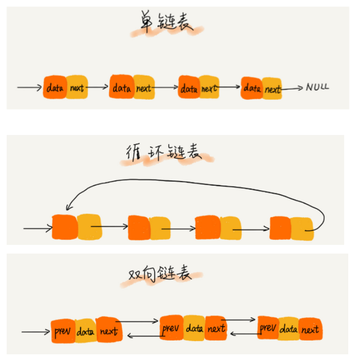
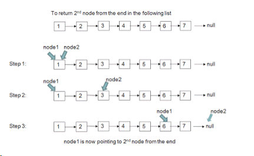

Linked List
==

链表是另一种常见数据结构。与数组类似，它也是线性数据结构，并以线性方式存储元素。

但是，与数组不同，它不会将它们存储在连续的位置。它通过“指针”将一组零散的内存块串联起来使用。

链表是一个节点列表，其中每个节点包含存储的值和下一个节点的地址。

由于这种结构，在链表中添加和删除元素很容易，因为只需要更改链接，但搜索很困难，并且通常需要花费O（n）时间来查找元素。

链表结构五花八门，三种最常见的链表结构，它们分别是：单链表、双向链表和循环链表。

直接上图吧：



为了解决基于链表的问题，良好的递归知识很重要，因为链表是递归数据结构。

好了，理论结束。

### 一次遍历找到单链表中间元素

题目：如何仅通过一次遍历找到单链表的中间元素？

链表和数组最大的区别就是不能任意访问其中一个元素，所以它的查找是O(n)的复杂度。

那么，如何才能通过一次遍历找到中间元素呢？

一个比较巧妙的做法就是使用两个指针，他们的分工是，一个指针指向当前遍历的元素，另一个指针隔一次往前挪一步。这样，当第一个指针指向链表尾部的时候，另一个指针刚好挪到中间位置。

我这里给了一个[可能的答案](./findMiddle.js)

当然，这种做法也可以举一反三，比如求链表的倒数第三个元素等等，这个就留给你来解答吧。


### 如何判断一个链表包含循环

题目：判断一个链表是否包含循环。

回忆一下我上面讲到的几种链表的种类，有单链表，双链表和循环链表。那么我们这次的题目是要判断链表是否包含循环，它并不一定是标准的循环链表（tail → next = head）哦。

再次提到两个指针的方法（看来两个指针是链表类型题目的常用方法呀），快速指针和慢速指针。 快速指针在每次迭代中移动两个节点，而慢速指针移动一个节点。 如果链表包含循环，则快速和慢速指针将在迭代期间的某个点处相遇。

挺巧妙吧？

你可以先自己尝试以下哦，这里是我给的[可能的实现方式](./isCycle.js)


### 单链表反转

这个应该是链表里面最常见的问题，但是要写正确也不太容易哦。

我们需要三个指针来进行遍历，也就是上一个节点（previous），当前节点（current），下一个节点（next）。

做法就是把当前节点的next指向previous，然后把current移动到next。

你可以试试了哦。

这里是可能的[解决方案](./reverList.js)


### 使用递归反转单链表

上次我们使用循环的方式来反转了单链表，这次我们试试用递归的方式来进行。

递归的核心就是将一个问题分解为更小的问题。

所以我们可以使用递归来将链表分解为更小的链表。

分解链表不难，这个题目解答的关键就是回朔的部分。

大家可以动手试试哦。

这里我给一个[可能的答案](./reverseListRecursive.js)


### 移除重复项

像数组一样，我们还是尝试一个很常见的题目：去重。

你能想到有几种方法呢？

我在数组那个去重的题目里，给的方案是先排序再去重，这里，我总结一下，不管对数组还是链表，去重的常见方法有三种：

- 两层循环（O(n^2)）
- 排序后去重（nlog(n)，快排）
- 使用哈希表（O(n)），但是需要额外空间

这次，我使用[双层循环给一个答案](./remove-duplicate.js)，你可以试试哈希的方法哈。


### 计算链表的长度

今天来一个简单的题目：计算链表的长度。

因为链表的最后一个元素的next指针总是指向null，所以，我们第一个想法一定是写一个循环，直到遍历到最后一个元素时，停止计数即可。

```js
let count = 0;
let current = list.head;
 
while (current) {
  count++;
  current = current.next;
}
return count;
```

稍微扩展一下，那如何使用递归来写呢？

你可以动手了哦！

今天的[参考答案](./find-length.js)


### 找倒数第三个节点

还记得我在第一题里问的扩展问题吗？两个指针的方法还可以用来一次遍历找到倒数第三个节点，当然，倒数第几个都可以。



这个图直观的展示了用两个指针的办法求倒数第二个节点。

好的，你可以动手了哦。

这里是我给的[参考答案](./get-last-node.js)